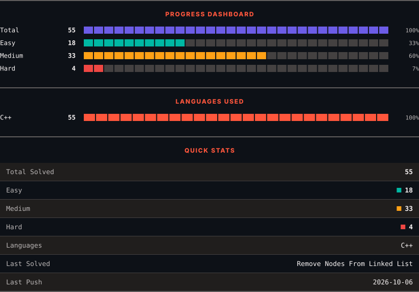
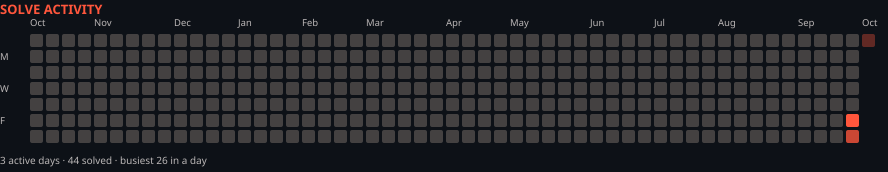

<h1>LeetCode Solutions</h1>

<em>Automatically synced with every accepted submission</em>

   

<picture>
  <source media="(prefers-color-scheme: dark)" srcset=".leetsync/stats-dark.svg">
  <source media="(prefers-color-scheme: light)" srcset=".leetsync/stats-light.svg">
  
</picture>

<picture>
  <source media="(prefers-color-scheme: dark)" srcset=".leetsync/calendar-dark.svg">
  <source media="(prefers-color-scheme: light)" srcset=".leetsync/calendar-light.svg">
  
</picture>

---

### ALL SOLUTIONS

| # | Problem | Difficulty | Language | Date |
|:---:|:--------|:----------:|:--------:|:----:|
| 2 | [Add Two Numbers](problems/0002-Add-Two-Numbers) | 🟧 Medium | `C++` | 2026-10-02 |
| 19 | [Remove Nth Node From End of List](problems/0019-Remove-Nth-Node-From-End-of-List) | 🟧 Medium | `C++` | 2026-10-02 |
| 21 | [Merge Two Sorted Lists](problems/0021-Merge-Two-Sorted-Lists) | 🟩 Easy | `C++` | 2026-10-02 |
| 24 | [Swap Nodes in Pairs](problems/0024-Swap-Nodes-in-Pairs) | 🟧 Medium | `C++` | 2026-10-02 |
| 25 | [Reverse Nodes in k-Group](problems/0025-Reverse-Nodes-in-k-Group) | 🟥 Hard | `C++` | 2026-10-02 |
| 61 | [Rotate List](problems/0061-Rotate-List) | 🟧 Medium | `C++` | 2026-10-02 |
| 82 | [Remove Duplicates from Sorted List II](problems/0082-Remove-Duplicates-from-Sorted-List-II) | 🟧 Medium | `C++` | 2026-10-02 |
| 83 | [Remove Duplicates from Sorted List](problems/0083-Remove-Duplicates-from-Sorted-List) | 🟩 Easy | `C++` | 2026-10-02 |
| 86 | [Partition List](problems/0086-Partition-List) | 🟧 Medium | `C++` | 2026-10-02 |
| 92 | [Reverse Linked List II](problems/0092-Reverse-Linked-List-II) | 🟧 Medium | `C++` | 2026-10-02 |
| 141 | [Linked List Cycle](problems/0141-Linked-List-Cycle) | 🟩 Easy | `C++` | 2026-10-02 |
| 142 | [Linked List Cycle II](problems/0142-Linked-List-Cycle-II) | 🟧 Medium | `C++` | 2026-10-02 |
| 143 | [Reorder List](problems/0143-Reorder-List) | 🟧 Medium | `C++` | 2026-10-02 |
| 147 | [Insertion Sort List](problems/0147-Insertion-Sort-List) | 🟧 Medium | `C++` | 2026-10-02 |
| 148 | [Sort List](problems/0148-Sort-List) | 🟧 Medium | `C++` | 2026-10-02 |
| 160 | [Intersection of Two Linked Lists](problems/0160-Intersection-of-Two-Linked-Lists) | 🟩 Easy | `C++` | 2026-10-02 |
| 203 | [Remove Linked List Elements](problems/0203-Remove-Linked-List-Elements) | 🟩 Easy | `C++` | 2026-10-02 |
| 206 | [Reverse Linked List](problems/0206-Reverse-Linked-List) | 🟩 Easy | `C++` | 2026-10-02 |
| 234 | [Palindrome Linked List](problems/0234-Palindrome-Linked-List) | 🟩 Easy | `C++` | 2026-10-02 |
| 237 | [Delete Node in a Linked List](problems/0237-Delete-Node-in-a-Linked-List) | 🟧 Medium | `C++` | 2026-10-02 |
| 328 | [Odd Even Linked List](problems/0328-Odd-Even-Linked-List) | 🟧 Medium | `C++` | 2026-10-02 |
| 876 | [Middle of the Linked List](problems/0876-Middle-of-the-Linked-List) | 🟩 Easy | `C++` | 2026-10-02 |
| 1290 | [Convert Binary Number in a Linked List to Integer](problems/1290-Convert-Binary-Number-in-a-Linked-List-to-Integer) | 🟩 Easy | `C++` | 2026-10-02 |
| 1721 | [Swapping Nodes in a Linked List](problems/1721-Swapping-Nodes-in-a-Linked-List) | 🟧 Medium | `C++` | 2026-10-02 |
| 2095 | [Delete the Middle Node of a Linked List](problems/2095-Delete-the-Middle-Node-of-a-Linked-List) | 🟧 Medium | `C++` | 2026-10-02 |
| 2487 | [Remove Nodes From Linked List](problems/2487-Remove-Nodes-From-Linked-List) | 🟧 Medium | `C++` | 2026-10-02 |

---

Auto-synced by <strong>LeetSync</strong> · Built by <a href="https://deveshsamant.in/">Devesh Samant</a>

