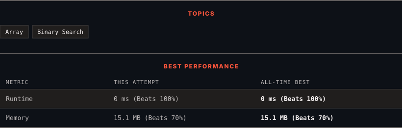

<div align="center">

# 33. Search in Rotated Sorted Array

      

[](https://leetcode.com/problems/search-in-rotated-sorted-array/)

</div>

---

<div align="center">

<picture>
  <source media="(prefers-color-scheme: dark)" srcset="panel-dark.svg">
  <source media="(prefers-color-scheme: light)" srcset="panel-light.svg">
  
</picture>

</div>

### HOW IT WENT

| | |
|:--|:--|
| **Attempts** | 2 before accepted |
| **Time to solve** | 4 min |
| **Verdicts** | ✅ Accepted → ✅ Accepted |

---

### NOTES

_No notes yet._

---

### SOLUTIONS (2)

| # | File | Language | Date |
|:-:|------|:--------:|:----:|
| 1 | [sol1.cpp](./sol1.cpp) | `C++` | 2026-10-04 |
| 2 | [sol2.cpp](./sol2.cpp) | `C++` | 2026-10-04 ← **latest** |

---

### PROBLEM DESCRIPTION

There is an integer array `nums` sorted in ascending order (with **distinct** values).

Prior to being passed to your function, `nums` is **possibly left rotated** at an unknown index `k` (`1 <= k < nums.length`) such that the resulting array is `[nums[k], nums[k+1], ..., nums[n-1], nums[0], nums[1], ..., nums[k-1]]` (**0-indexed**). For example, `[0,1,2,4,5,6,7]` might be left rotated by `3` indices and become `[4,5,6,7,0,1,2]`.

Given the array `nums` **after** the possible rotation and an integer `target`, return *the index of *`target`* if it is in *`nums`*, or *`-1`* if it is not in *`nums`.

You must write an algorithm with `O(log n)` runtime complexity.

 

**Example 1:**

```
**Input:** nums = [4,5,6,7,0,1,2], target = 0
**Output:** 4

```

**Example 2:**

```
**Input:** nums = [4,5,6,7,0,1,2], target = 3
**Output:** -1

```

**Example 3:**

```
**Input:** nums = [1], target = 0
**Output:** -1

```

 

**Constraints:**

	- `1 <= nums.length <= 5000`

	- `-10^4 <= nums[i] <= 10^4`

	- All values of `nums` are **unique**.

	- `nums` is an ascending array that is possibly rotated.

	- `-10^4 <= target <= 10^4`

---

<div align="center">

<sub>Auto-synced by <strong>LeetSync</strong> · Built by <a href="https://deveshsamant.in/">Devesh Samant</a></sub>

</div>
