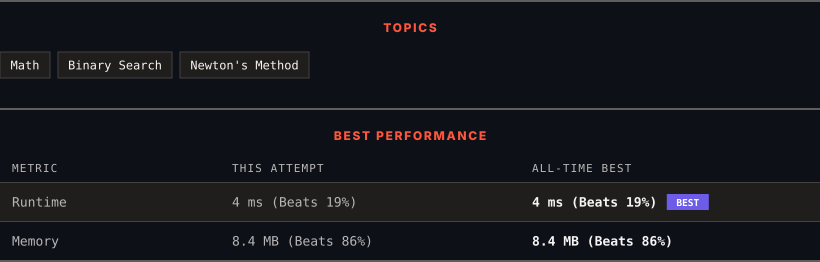

<div align="center">

# 69. Sqrt(x)

      

[](https://leetcode.com/problems/sqrtx/)

</div>

---

<div align="center">

<picture>
  <source media="(prefers-color-scheme: dark)" srcset="panel-dark.svg">
  <source media="(prefers-color-scheme: light)" srcset="panel-light.svg">
  
</picture>

</div>

> **New personal best** — Runtime improved on this submission.

### HOW IT WENT

| | |
|:--|:--|
| **Attempts** | first try |
| **Time to solve** | under a minute |
| **Verdicts** | ✅ Accepted |

---

### NOTES

_No notes yet._

---

### SOLUTIONS (1)

| # | File | Language | Date |
|:-:|------|:--------:|:----:|
| 1 | [sol1.cpp](./sol1.cpp) | `C++` | 2026-10-03 ← **latest** |

---

### PROBLEM DESCRIPTION

Given a non-negative integer `x`, return *the square root of *`x`* rounded down to the nearest integer*. The returned integer should be **non-negative** as well.

You **must not use** any built-in exponent function or operator.

	- For example, do not use `pow(x, 0.5)` in c++ or `x ** 0.5` in python.

 

**Example 1:**

```

**Input:** x = 4
**Output:** 2
**Explanation:** The square root of 4 is 2, so we return 2.

```

**Example 2:**

```

**Input:** x = 8
**Output:** 2
**Explanation:** The square root of 8 is 2.82842..., and since we round it down to the nearest integer, 2 is returned.

```

 

**Constraints:**

	- `0 <= x <= 2^31 - 1`

---

<div align="center">

<sub>Auto-synced by <strong>LeetSync</strong> · Built by <a href="https://deveshsamant.in/">Devesh Samant</a></sub>

</div>
