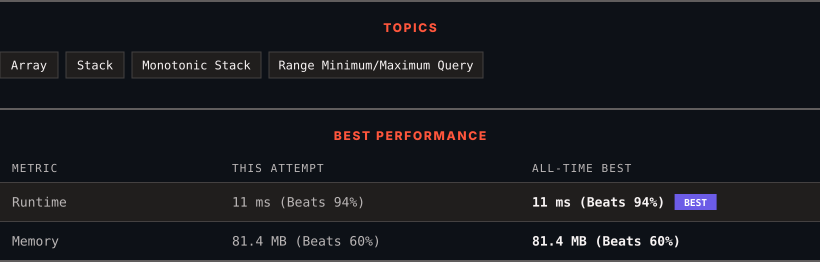

<div align="center">

# 84. Largest Rectangle in Histogram

      

[](https://leetcode.com/problems/largest-rectangle-in-histogram/)

</div>

---

<div align="center">

<picture>
  <source media="(prefers-color-scheme: dark)" srcset="panel-dark.svg">
  <source media="(prefers-color-scheme: light)" srcset="panel-light.svg">
  
</picture>

</div>

> **New personal best** — Runtime improved on this submission.

### HOW IT WENT

| | |
|:--|:--|
| **Attempts** | 3 before accepted |
| **Time to solve** | 1 h 5 min |
| **Verdicts** | ⏱ Time Limit Exceeded → 🔧 Compile Error → ✅ Accepted |

---

### NOTES

_No notes yet._

---

### SOLUTIONS (1)

| # | File | Language | Date |
|:-:|------|:--------:|:----:|
| 1 | [sol1.cpp](./sol1.cpp) | `C++` | 2026-10-06 ← **latest** |

---

### PROBLEM DESCRIPTION

Given an array of integers `heights` representing the histogram's bar height where the width of each bar is `1`, return *the area of the largest rectangle in the histogram*.

 

**Example 1:**


```

**Input:** heights = [2,1,5,6,2,3]
**Output:** 10
**Explanation:** The above is a histogram where width of each bar is 1.
The largest rectangle is shown in the red area, which has an area = 10 units.

```

**Example 2:**


```

**Input:** heights = [2,4]
**Output:** 4

```

 

**Constraints:**

	- `1 <= heights.length <= 10^5`

	- `0 <= heights[i] <= 10^4`

---

<div align="center">

<sub>Auto-synced by <strong>LeetSync</strong> · Built by <a href="https://deveshsamant.in/">Devesh Samant</a></sub>

</div>
