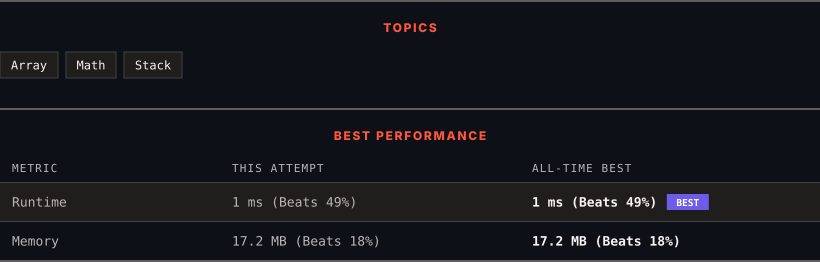

<div align="center">

# 150. Evaluate Reverse Polish Notation

      

[](https://leetcode.com/problems/evaluate-reverse-polish-notation/)

</div>

---

<div align="center">

<picture>
  <source media="(prefers-color-scheme: dark)" srcset="panel-dark.svg">
  <source media="(prefers-color-scheme: light)" srcset="panel-light.svg">
  
</picture>

</div>

> **New personal best** — Runtime improved on this submission.

### HOW IT WENT

| | |
|:--|:--|
| **Attempts** | first try |
| **Time to solve** | 19 min |
| **Verdicts** | ✅ Accepted |

---

### NOTES

_No notes yet._

---

### SOLUTIONS (1)

| # | File | Language | Date |
|:-:|------|:--------:|:----:|
| 1 | [sol1.cpp](./sol1.cpp) | `C++` | 2026-10-08 ← **latest** |

---

### PROBLEM DESCRIPTION

You are given an array of strings `tokens` that represents an arithmetic expression in a [Reverse Polish Notation](http://en.wikipedia.org/wiki/Reverse_Polish_notation).

Evaluate the expression. Return *an integer that represents the value of the expression*.

**Note** that:

	- The valid operators are `'+'`, `'-'`, `'*'`, and `'/'`.

	- Each operand may be an integer or another expression.

	- The division between two integers always **truncates toward zero**.

	- There will not be any division by zero.

	- The input represents a valid arithmetic expression in a reverse polish notation.

	- The answer and all the intermediate calculations can be represented in a **32-bit** integer.

 

**Example 1:**

```

**Input:** tokens = ["2","1","+","3","*"]
**Output:** 9
**Explanation:** ((2 + 1) * 3) = 9

```

**Example 2:**

```

**Input:** tokens = ["4","13","5","/","+"]
**Output:** 6
**Explanation:** (4 + (13 / 5)) = 6

```

**Example 3:**

```

**Input:** tokens = ["10","6","9","3","+","-11","*","/","*","17","+","5","+"]
**Output:** 22
**Explanation:** ((10 * (6 / ((9 + 3) * -11))) + 17) + 5
= ((10 * (6 / (12 * -11))) + 17) + 5
= ((10 * (6 / -132)) + 17) + 5
= ((10 * 0) + 17) + 5
= (0 + 17) + 5
= 17 + 5
= 22

```

 

**Constraints:**

	- `1 <= tokens.length <= 10^4`

	- `tokens[i]` is either an operator: `"+"`, `"-"`, `"*"`, or `"/"`, or an integer in the range `[-200, 200]`.

---

<div align="center">

<sub>Auto-synced by <strong>LeetSync</strong> · Built by <a href="https://deveshsamant.in/">Devesh Samant</a></sub>

</div>
