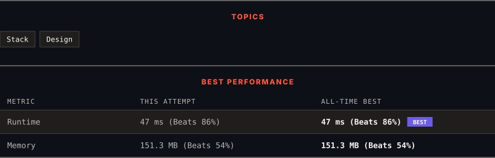

<div align="center">

# 155. Min Stack

      

[](https://leetcode.com/problems/min-stack/)

</div>

---

<div align="center">

<picture>
  <source media="(prefers-color-scheme: dark)" srcset="panel-dark.svg">
  <source media="(prefers-color-scheme: light)" srcset="panel-light.svg">
  
</picture>

</div>

> **New personal best** — Runtime improved on this submission.

### HOW IT WENT

| | |
|:--|:--|
| **Attempts** | 2 before accepted |
| **Time to solve** | 8 min |
| **Verdicts** | 🔧 Compile Error → ✅ Accepted |

---

### NOTES

_No notes yet._

---

### SOLUTIONS (1)

| # | File | Language | Date |
|:-:|------|:--------:|:----:|
| 1 | [sol1.cpp](./sol1.cpp) | `C++` | 2026-10-05 ← **latest** |

---

### PROBLEM DESCRIPTION

Design a stack that supports push, pop, top, and retrieving the minimum element in constant time.

Implement the `MinStack` class:

	- `MinStack()` initializes the stack object.

	- `void push(int value)` pushes the element `value` onto the stack.

	- `void pop()` removes the element on the top of the stack.

	- `int top()` gets the top element of the stack.

	- `int getMin()` retrieves the minimum element in the stack.

You must implement a solution with `O(1)` time complexity for each function.

 

**Example 1:**

```

**Input**
["MinStack","push","push","push","getMin","pop","top","getMin"]
[[],[-2],[0],[-3],[],[],[],[]]

**Output**
[null,null,null,null,-3,null,0,-2]

**Explanation**
MinStack minStack = new MinStack();
minStack.push(-2);
minStack.push(0);
minStack.push(-3);
minStack.getMin(); // return -3
minStack.pop();
minStack.top();    // return 0
minStack.getMin(); // return -2

```

 

**Constraints:**

	- `-2^31 <= val <= 2^31 - 1`

	- Methods `pop`, `top` and `getMin` operations will always be called on **non-empty** stacks.

	- At most `3 * 10^4` calls will be made to `push`, `pop`, `top`, and `getMin`.

---

<div align="center">

<sub>Auto-synced by <strong>LeetSync</strong> · Built by <a href="https://deveshsamant.in/">Devesh Samant</a></sub>

</div>
