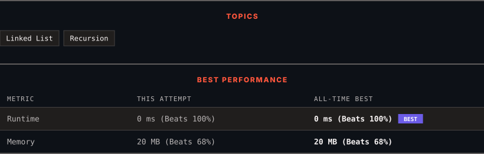

<div align="center">

# 203. Remove Linked List Elements

      

[](https://leetcode.com/problems/remove-linked-list-elements/)

</div>

---

<div align="center">

<picture>
  <source media="(prefers-color-scheme: dark)" srcset="panel-dark.svg">
  <source media="(prefers-color-scheme: light)" srcset="panel-light.svg">
  
</picture>

</div>

> **New personal best** — Runtime improved on this submission.

### HOW IT WENT

| | |
|:--|:--|
| **Attempts** | first try |
| **Time to solve** | under a minute |
| **Verdicts** | ✅ Accepted |

---

### NOTES

_No notes yet._

---

### SOLUTIONS (1)

| # | File | Language | Date |
|:-:|------|:--------:|:----:|
| 1 | [sol1.cpp](./sol1.cpp) | `C++` | 2026-10-02 ← **latest** |

---

### PROBLEM DESCRIPTION

Given the `head` of a linked list and an integer `val`, remove all the nodes of the linked list that has `Node.val == val`, and return *the new head*.

 

**Example 1:**


```

**Input:** head = [1,2,6,3,4,5,6], val = 6
**Output:** [1,2,3,4,5]

```

**Example 2:**

```

**Input:** head = [], val = 1
**Output:** []

```

**Example 3:**

```

**Input:** head = [7,7,7,7], val = 7
**Output:** []

```

 

**Constraints:**

	- The number of nodes in the list is in the range `[0, 10^4]`.

	- `1 <= Node.val <= 50`

	- `0 <= val <= 50`

---

<div align="center">

<sub>Auto-synced by <strong>LeetSync</strong> · Built by <a href="https://deveshsamant.in/">Devesh Samant</a></sub>

</div>
