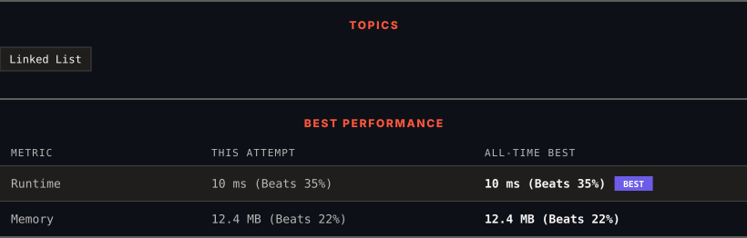

<div align="center">

# 237. Delete Node in a Linked List

      

[](https://leetcode.com/problems/delete-node-in-a-linked-list/)

</div>

---

<div align="center">

<picture>
  <source media="(prefers-color-scheme: dark)" srcset="panel-dark.svg">
  <source media="(prefers-color-scheme: light)" srcset="panel-light.svg">
  
</picture>

</div>

> **New personal best** — Runtime improved on this submission.

### HOW IT WENT

| | |
|:--|:--|
| **Attempts** | first try |
| **Time to solve** | under a minute |
| **Verdicts** | ✅ Accepted |

---

### NOTES

_No notes yet._

---

### SOLUTIONS (1)

| # | File | Language | Date |
|:-:|------|:--------:|:----:|
| 1 | [sol1.cpp](./sol1.cpp) | `C++` | 2026-10-02 ← **latest** |

---

### PROBLEM DESCRIPTION

There is a singly-linked list `head` and we want to delete a node `node` in it.

You are given the node to be deleted `node`. You will **not be given access** to the first node of `head`.

All the values of the linked list are **unique**, and it is guaranteed that the given node `node` is not the last node in the linked list.

Delete the given node. Note that by deleting the node, we do not mean removing it from memory. We mean:

	- The value of the given node should not exist in the linked list.

	- The number of nodes in the linked list should decrease by one.

	- All the values before `node` should be in the same order.

	- All the values after `node` should be in the same order.

**Custom testing:**

	- For the input, you should provide the entire linked list `head` and the node to be given `node`. `node` should not be the last node of the list and should be an actual node in the list.

	- We will build the linked list and pass the node to your function.

	- The output will be the entire list after calling your function.

 

**Example 1:**


```

**Input:** head = [4,5,1,9], node = 5
**Output:** [4,1,9]
**Explanation: **You are given the second node with value 5, the linked list should become 4 -> 1 -> 9 after calling your function.

```

**Example 2:**


```

**Input:** head = [4,5,1,9], node = 1
**Output:** [4,5,9]
**Explanation: **You are given the third node with value 1, the linked list should become 4 -> 5 -> 9 after calling your function.

```

 

**Constraints:**

	- The number of the nodes in the given list is in the range `[2, 1000]`.

	- `-1000 <= Node.val <= 1000`

	- The value of each node in the list is **unique**.

	- The `node` to be deleted is **in the list** and is **not a tail** node.

---

<div align="center">

<sub>Auto-synced by <strong>LeetSync</strong> · Built by <a href="https://deveshsamant.in/">Devesh Samant</a></sub>

</div>
