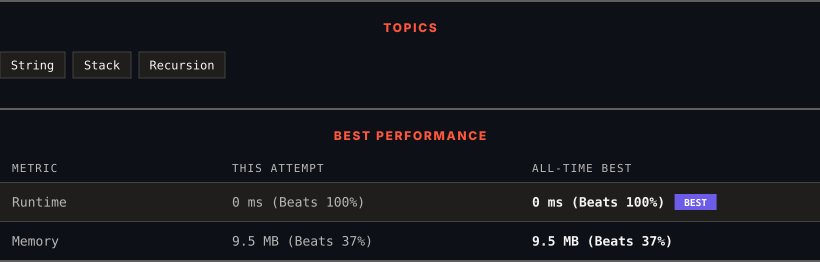

<div align="center">

# 394. Decode String

      

[](https://leetcode.com/problems/decode-string/)

</div>

---

<div align="center">

<picture>
  <source media="(prefers-color-scheme: dark)" srcset="panel-dark.svg">
  <source media="(prefers-color-scheme: light)" srcset="panel-light.svg">
  
</picture>

</div>

> **New personal best** — Runtime improved on this submission.

### HOW IT WENT

| | |
|:--|:--|
| **Attempts** | first try |
| **Time to solve** | 6 min |
| **Verdicts** | ✅ Accepted |

---

### NOTES

_No notes yet._

---

### SOLUTIONS (1)

| # | File | Language | Date |
|:-:|------|:--------:|:----:|
| 1 | [sol1.cpp](./sol1.cpp) | `C++` | 2026-10-08 ← **latest** |

---

### PROBLEM DESCRIPTION

Given an encoded string, return its decoded string.

The encoding rule is: `k[encoded_string]`, where the `encoded_string` inside the square brackets is being repeated exactly `k` times. Note that `k` is guaranteed to be a positive integer.

You may assume that the input string is always valid; there are no extra white spaces, square brackets are well-formed, etc. Furthermore, you may assume that the original data does not contain any digits and that digits are only for those repeat numbers, `k`. For example, there will not be input like `3a` or `2[4]`.

The test cases are generated so that the length of the output will never exceed `10^5`.

 

**Example 1:**

```

**Input:** s = "3[a]2[bc]"
**Output:** "aaabcbc"

```

**Example 2:**

```

**Input:** s = "3[a2[c]]"
**Output:** "accaccacc"

```

**Example 3:**

```

**Input:** s = "2[abc]3[cd]ef"
**Output:** "abcabccdcdcdef"

```

 

**Constraints:**

	- `1 <= s.length <= 30`

	- `s` consists of lowercase English letters, digits, and square brackets `'[]'`.

	- `s` is guaranteed to be **a valid** input.

	- All the integers in `s` are in the range `[1, 300]`.

---

<div align="center">

<sub>Auto-synced by <strong>LeetSync</strong> · Built by <a href="https://deveshsamant.in/">Devesh Samant</a></sub>

</div>
