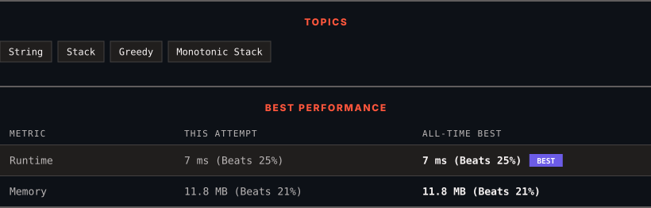

<div align="center">

# 402. Remove K Digits

      

[](https://leetcode.com/problems/remove-k-digits/)

</div>

---

<div align="center">

<picture>
  <source media="(prefers-color-scheme: dark)" srcset="panel-dark.svg">
  <source media="(prefers-color-scheme: light)" srcset="panel-light.svg">
  
</picture>

</div>

> **New personal best** — Runtime improved on this submission.

### HOW IT WENT

| | |
|:--|:--|
| **Attempts** | first try |
| **Time to solve** | 9 min |
| **Verdicts** | ✅ Accepted |

---

### NOTES

_No notes yet._

---

### SOLUTIONS (1)

| # | File | Language | Date |
|:-:|------|:--------:|:----:|
| 1 | [sol1.cpp](./sol1.cpp) | `C++` | 2026-10-08 ← **latest** |

---

### PROBLEM DESCRIPTION

Given string num representing a non-negative integer `num`, and an integer `k`, return *the smallest possible integer after removing* `k` *digits from* `num`.

 

**Example 1:**

```

**Input:** num = "1432219", k = 3
**Output:** "1219"
**Explanation:** Remove the three digits 4, 3, and 2 to form the new number 1219 which is the smallest.

```

**Example 2:**

```

**Input:** num = "10200", k = 1
**Output:** "200"
**Explanation:** Remove the leading 1 and the number is 200. Note that the output must not contain leading zeroes.

```

**Example 3:**

```

**Input:** num = "10", k = 2
**Output:** "0"
**Explanation:** Remove all the digits from the number and it is left with nothing which is 0.

```

 

**Constraints:**

	- `1 <= k <= num.length <= 10^5`

	- `num` consists of only digits.

	- `num` does not have any leading zeros except for the zero itself.

---

<div align="center">

<sub>Auto-synced by <strong>LeetSync</strong> · Built by <a href="https://deveshsamant.in/">Devesh Samant</a></sub>

</div>
