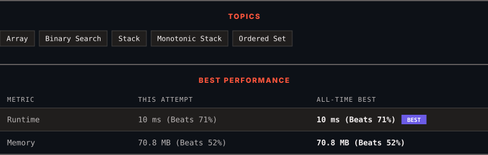

<div align="center">

# 456. 132 Pattern

      

[](https://leetcode.com/problems/132-pattern/)

</div>

---

<div align="center">

<picture>
  <source media="(prefers-color-scheme: dark)" srcset="panel-dark.svg">
  <source media="(prefers-color-scheme: light)" srcset="panel-light.svg">
  
</picture>

</div>

> **New personal best** — Runtime improved on this submission.

### HOW IT WENT

| | |
|:--|:--|
| **Attempts** | first try |
| **Time to solve** | 28 min |
| **Verdicts** | ✅ Accepted |

---

### NOTES

_No notes yet._

---

### SOLUTIONS (1)

| # | File | Language | Date |
|:-:|------|:--------:|:----:|
| 1 | [sol1.cpp](./sol1.cpp) | `C++` | 2026-10-08 ← **latest** |

---

### PROBLEM DESCRIPTION

Given an array of `n` integers `nums`, a **132 pattern** is a subsequence of three integers `nums[i]`, `nums[j]` and `nums[k]` such that `i < j < k` and `nums[i] < nums[k] < nums[j]`.

Return `true`* if there is a **132 pattern** in *`nums`*, otherwise, return *`false`*.*

 

**Example 1:**

```

**Input:** nums = [1,2,3,4]
**Output:** false
**Explanation:** There is no 132 pattern in the sequence.

```

**Example 2:**

```

**Input:** nums = [3,1,4,2]
**Output:** true
**Explanation:** There is a 132 pattern in the sequence: [1, 4, 2].

```

**Example 3:**

```

**Input:** nums = [-1,3,2,0]
**Output:** true
**Explanation:** There are three 132 patterns in the sequence: [-1, 3, 2], [-1, 3, 0] and [-1, 2, 0].

```

 

**Constraints:**

	- `n == nums.length`

	- `1 <= n <= 2 * 10^5`

	- `-10^9 <= nums[i] <= 10^9`

---

<div align="center">

<sub>Auto-synced by <strong>LeetSync</strong> · Built by <a href="https://deveshsamant.in/">Devesh Samant</a></sub>

</div>
