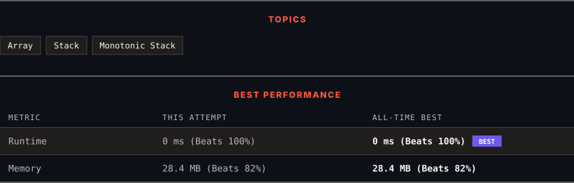

<div align="center">

# 503. Next Greater Element II

      

[](https://leetcode.com/problems/next-greater-element-ii/)

</div>

---

<div align="center">

<picture>
  <source media="(prefers-color-scheme: dark)" srcset="panel-dark.svg">
  <source media="(prefers-color-scheme: light)" srcset="panel-light.svg">
  
</picture>

</div>

> **New personal best** — Runtime improved on this submission.

### HOW IT WENT

| | |
|:--|:--|
| **Attempts** | first try |
| **Time to solve** | 17 min |
| **Verdicts** | ✅ Accepted |

---

### NOTES

_No notes yet._

---

### SOLUTIONS (1)

| # | File | Language | Date |
|:-:|------|:--------:|:----:|
| 1 | [sol1.cpp](./sol1.cpp) | `C++` | 2026-10-05 ← **latest** |

---

### PROBLEM DESCRIPTION

Given a circular integer array `nums` (i.e., the next element of `nums[nums.length - 1]` is `nums[0]`), return *the **next greater number** for every element in* `nums`.

The **next greater number** of a number `x` is the first greater number to its traversing-order next in the array, which means you could search circularly to find its next greater number. If it doesn't exist, return `-1` for this number.

 

**Example 1:**

```

**Input:** nums = [1,2,1]
**Output:** [2,-1,2]
Explanation: The first 1's next greater number is 2; 
The number 2 can't find next greater number. 
The second 1's next greater number needs to search circularly, which is also 2.

```

**Example 2:**

```

**Input:** nums = [1,2,3,4,3]
**Output:** [2,3,4,-1,4]

```

 

**Constraints:**

	- `1 <= nums.length <= 10^4`

	- `-10^9 <= nums[i] <= 10^9`

---

<div align="center">

<sub>Auto-synced by <strong>LeetSync</strong> · Built by <a href="https://deveshsamant.in/">Devesh Samant</a></sub>

</div>
