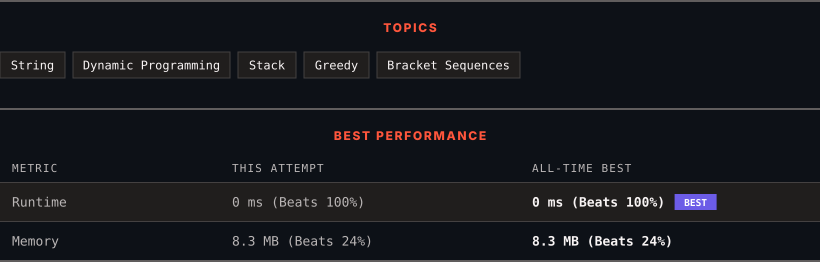

<div align="center">

# 678. Valid Parenthesis String

      

[](https://leetcode.com/problems/valid-parenthesis-string/)

</div>

---

<div align="center">

<picture>
  <source media="(prefers-color-scheme: dark)" srcset="panel-dark.svg">
  <source media="(prefers-color-scheme: light)" srcset="panel-light.svg">
  
</picture>

</div>

> **New personal best** — Runtime improved on this submission.

### HOW IT WENT

| | |
|:--|:--|
| **Attempts** | 2 before accepted |
| **Time to solve** | 54 min |
| **Verdicts** | 🔧 Compile Error → ✅ Accepted |

---

### NOTES

_No notes yet._

---

### SOLUTIONS (1)

| # | File | Language | Date |
|:-:|------|:--------:|:----:|
| 1 | [sol1.cpp](./sol1.cpp) | `C++` | 2026-10-06 ← **latest** |

---

### PROBLEM DESCRIPTION

Given a string `s` containing only three types of characters: `'('`, `')'` and `'*'`, return `true` *if* `s` *is **valid***.

The following rules define a **valid** string:

	- Any left parenthesis `'('` must have a corresponding right parenthesis `')'`.

	- Any right parenthesis `')'` must have a corresponding left parenthesis `'('`.

	- Left parenthesis `'('` must go before the corresponding right parenthesis `')'`.

	- `'*'` could be treated as a single right parenthesis `')'` or a single left parenthesis `'('` or an empty string `""`.

 

**Example 1:**

```

**Input:** s = "()"
**Output:** true

```

**Example 2:**

```

**Input:** s = "(*)"
**Output:** true

```

**Example 3:**

```

**Input:** s = "(*))"
**Output:** true

```

**Example 4:**

```

**Input:** s = "("
**Output:** false

```

 

**Constraints:**

	- `1 <= s.length <= 100`

	- `s[i]` is `'('`, `')'` or `'*'`.

---

<div align="center">

<sub>Auto-synced by <strong>LeetSync</strong> · Built by <a href="https://deveshsamant.in/">Devesh Samant</a></sub>

</div>
