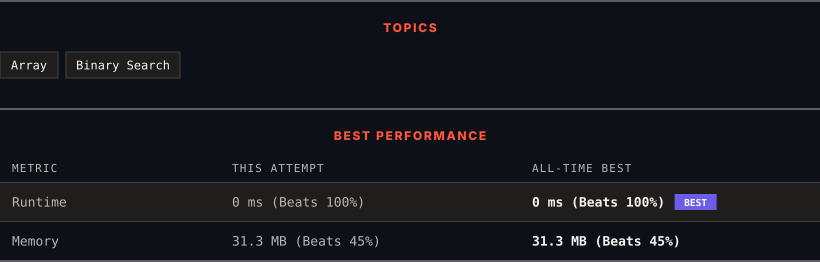

<div align="center">

# 704. Binary Search

      

[](https://leetcode.com/problems/binary-search/)

</div>

---

<div align="center">

<picture>
  <source media="(prefers-color-scheme: dark)" srcset="panel-dark.svg">
  <source media="(prefers-color-scheme: light)" srcset="panel-light.svg">
  
</picture>

</div>

> **New personal best** — Runtime improved on this submission.

### HOW IT WENT

| | |
|:--|:--|
| **Attempts** | 4 before accepted |
| **Time to solve** | 1 min |
| **Verdicts** | 🔧 Compile Error → ❌ Wrong Answer → ❌ Wrong Answer → ✅ Accepted |

---

### NOTES

_No notes yet._

---

### SOLUTIONS (1)

| # | File | Language | Date |
|:-:|------|:--------:|:----:|
| 1 | [sol1.cpp](./sol1.cpp) | `C++` | 2026-10-03 ← **latest** |

---

### PROBLEM DESCRIPTION

Given an array of integers `nums` which is sorted in ascending order, and an integer `target`, write a function to search `target` in `nums`. If `target` exists, then return its index. Otherwise, return `-1`.

You must write an algorithm with `O(log n)` runtime complexity.

 

**Example 1:**

```

**Input:** nums = [-1,0,3,5,9,12], target = 9
**Output:** 4
**Explanation:** 9 exists in nums and its index is 4

```

**Example 2:**

```

**Input:** nums = [-1,0,3,5,9,12], target = 2
**Output:** -1
**Explanation:** 2 does not exist in nums so return -1

```

 

**Constraints:**

	- `1 <= nums.length <= 10^4`

	- `-10^4 < nums[i], target < 10^4`

	- All the integers in `nums` are **unique**.

	- `nums` is sorted in ascending order.

---

<div align="center">

<sub>Auto-synced by <strong>LeetSync</strong> · Built by <a href="https://deveshsamant.in/">Devesh Samant</a></sub>

</div>
