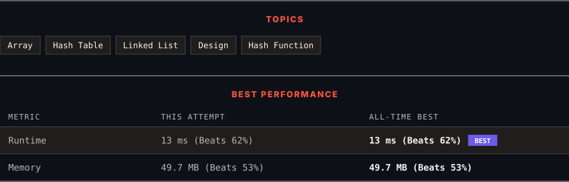

<div align="center">

# 705. Design HashSet

      

[](https://leetcode.com/problems/design-hashset/)

</div>

---

<div align="center">

<picture>
  <source media="(prefers-color-scheme: dark)" srcset="panel-dark.svg">
  <source media="(prefers-color-scheme: light)" srcset="panel-light.svg">
  
</picture>

</div>

> **New personal best** — Runtime improved on this submission.

### HOW IT WENT

| | |
|:--|:--|
| **Attempts** | first try |
| **Time to solve** | 28 h 20 min |
| **Verdicts** | ✅ Accepted |

---

### NOTES

_No notes yet._

---

### SOLUTIONS (1)

| # | File | Language | Date |
|:-:|------|:--------:|:----:|
| 1 | [sol1.cpp](./sol1.cpp) | `C++` | 2026-10-03 ← **latest** |

---

### PROBLEM DESCRIPTION

Design a HashSet without using any built-in hash table libraries.

Implement `MyHashSet` class:

	- `void add(key)` Inserts the value `key` into the HashSet.

	- `bool contains(key)` Returns whether the value `key` exists in the HashSet or not.

	- `void remove(key)` Removes the value `key` in the HashSet. If `key` does not exist in the HashSet, do nothing.

 

**Example 1:**

```

**Input**
["MyHashSet", "add", "add", "contains", "contains", "add", "contains", "remove", "contains"]
[[], [1], [2], [1], [3], [2], [2], [2], [2]]
**Output**
[null, null, null, true, false, null, true, null, false]

**Explanation**
MyHashSet myHashSet = new MyHashSet();
myHashSet.add(1);      // set = [1]
myHashSet.add(2);      // set = [1, 2]
myHashSet.contains(1); // return True
myHashSet.contains(3); // return False, (not found)
myHashSet.add(2);      // set = [1, 2]
myHashSet.contains(2); // return True
myHashSet.remove(2);   // set = [1]
myHashSet.contains(2); // return False, (already removed)
```

 

**Constraints:**

	- `0 <= key <= 10^6`

	- At most `10^4` calls will be made to `add`, `remove`, and `contains`.

---

<div align="center">

<sub>Auto-synced by <strong>LeetSync</strong> · Built by <a href="https://deveshsamant.in/">Devesh Samant</a></sub>

</div>
