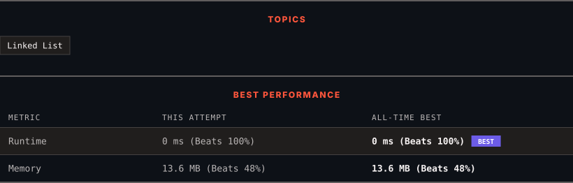

<div align="center">

# 725. Split Linked List in Parts

      

[](https://leetcode.com/problems/split-linked-list-in-parts/)

</div>

---

<div align="center">

<picture>
  <source media="(prefers-color-scheme: dark)" srcset="panel-dark.svg">
  <source media="(prefers-color-scheme: light)" srcset="panel-light.svg">
  
</picture>

</div>

> **New personal best** — Runtime improved on this submission.

### HOW IT WENT

| | |
|:--|:--|
| **Attempts** | first try |
| **Time to solve** | under a minute |
| **Verdicts** | ✅ Accepted |

---

### NOTES

_No notes yet._

---

### SOLUTIONS (1)

| # | File | Language | Date |
|:-:|------|:--------:|:----:|
| 1 | [sol1.cpp](./sol1.cpp) | `C++` | 2026-10-03 ← **latest** |

---

### PROBLEM DESCRIPTION

Given the `head` of a singly linked list and an integer `k`, split the linked list into `k` consecutive linked list parts.

The length of each part should be as equal as possible: no two parts should have a size differing by more than one. This may lead to some parts being null.

The parts should be in the order of occurrence in the input list, and parts occurring earlier should always have a size greater than or equal to parts occurring later.

Return *an array of the *`k`* parts*.

 

**Example 1:**


```

**Input:** head = [1,2,3], k = 5
**Output:** [[1],[2],[3],[],[]]
**Explanation:**
The first element output[0] has output[0].val = 1, output[0].next = null.
The last element output[4] is null, but its string representation as a ListNode is [].

```

**Example 2:**


```

**Input:** head = [1,2,3,4,5,6,7,8,9,10], k = 3
**Output:** [[1,2,3,4],[5,6,7],[8,9,10]]
**Explanation:**
The input has been split into consecutive parts with size difference at most 1, and earlier parts are a larger size than the later parts.

```

 

**Constraints:**

	- The number of nodes in the list is in the range `[0, 1000]`.

	- `0 <= Node.val <= 1000`

	- `1 <= k <= 50`

---

<div align="center">

<sub>Auto-synced by <strong>LeetSync</strong> · Built by <a href="https://deveshsamant.in/">Devesh Samant</a></sub>

</div>
