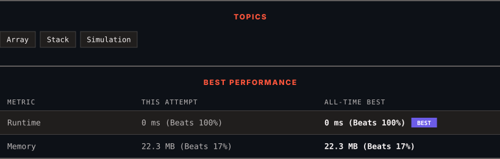

<div align="center">

# 735. Asteroid Collision

      

[](https://leetcode.com/problems/asteroid-collision/)

</div>

---

<div align="center">

<picture>
  <source media="(prefers-color-scheme: dark)" srcset="panel-dark.svg">
  <source media="(prefers-color-scheme: light)" srcset="panel-light.svg">
  
</picture>

</div>

> **New personal best** — Runtime improved on this submission.

### HOW IT WENT

| | |
|:--|:--|
| **Attempts** | first try |
| **Time to solve** | 42 min |
| **Verdicts** | ✅ Accepted |

---

### NOTES

_No notes yet._

---

### SOLUTIONS (1)

| # | File | Language | Date |
|:-:|------|:--------:|:----:|
| 1 | [sol1.cpp](./sol1.cpp) | `C++` | 2026-10-10 ← **latest** |

---

### PROBLEM DESCRIPTION

We are given an array `asteroids` of integers representing asteroids in a row. The indices of the asteroid in the array represent their relative position in space.

For each asteroid, the absolute value represents its size, and the sign represents its direction (positive meaning right, negative meaning left). Each asteroid moves at the same speed.

Find out the state of the asteroids after all collisions. If two asteroids meet, the smaller one will explode. If both are the same size, both will explode. Two asteroids moving in the same direction will never meet.

 

**Example 1:**

```

**Input:** asteroids = [5,10,-5]
**Output:** [5,10]
**Explanation:** The 10 and -5 collide resulting in 10. The 5 and 10 never collide.

```

**Example 2:**

```

**Input:** asteroids = [8,-8]
**Output:** []
**Explanation:** The 8 and -8 collide exploding each other.

```

**Example 3:**

```

**Input:** asteroids = [10,2,-5]
**Output:** [10]
**Explanation:** The 2 and -5 collide resulting in -5. The 10 and -5 collide resulting in 10.

```

**Example 4:**

```

**Input:** asteroids = [3,5,-6,2,-1,4]​​​​​​​
**Output:** [-6,2,4]
**Explanation:** The asteroid -6 makes the asteroid 3 and 5 explode, and then continues going left. On the other side, the asteroid 2 destroys -1. Since 2 and 4 are both moving right, they never collide.

```

 

**Constraints:**

	- `2 <= asteroids.length <= 10^4`

	- `-1000 <= asteroids[i] <= 1000`

	- `asteroids[i] != 0`

---

<div align="center">

<sub>Auto-synced by <strong>LeetSync</strong> · Built by <a href="https://deveshsamant.in/">Devesh Samant</a></sub>

</div>
