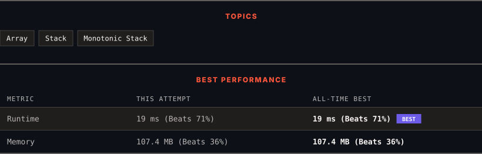

<div align="center">

# 739. Daily Temperatures

      

[](https://leetcode.com/problems/daily-temperatures/)

</div>

---

<div align="center">

<picture>
  <source media="(prefers-color-scheme: dark)" srcset="panel-dark.svg">
  <source media="(prefers-color-scheme: light)" srcset="panel-light.svg">
  
</picture>

</div>

> **New personal best** — Runtime improved on this submission.

### HOW IT WENT

| | |
|:--|:--|
| **Attempts** | first try |
| **Time to solve** | under a minute |
| **Verdicts** | ✅ Accepted |

---

### NOTES

_No notes yet._

---

### SOLUTIONS (1)

| # | File | Language | Date |
|:-:|------|:--------:|:----:|
| 1 | [sol1.cpp](./sol1.cpp) | `C++` | 2026-10-05 ← **latest** |

---

### PROBLEM DESCRIPTION

Given an array of integers `temperatures` represents the daily temperatures, return *an array* `answer` *such that* `answer[i]` *is the number of days you have to wait after the* `i^th` *day to get a warmer temperature*. If there is no future day for which this is possible, keep `answer[i] == 0` instead.

 

**Example 1:**

```
**Input:** temperatures = [73,74,75,71,69,72,76,73]
**Output:** [1,1,4,2,1,1,0,0]

```

**Example 2:**

```
**Input:** temperatures = [30,40,50,60]
**Output:** [1,1,1,0]

```

**Example 3:**

```
**Input:** temperatures = [30,60,90]
**Output:** [1,1,0]

```

 

**Constraints:**

	- `1 <= temperatures.length <= 10^5`

	- `30 <= temperatures[i] <= 100`

---

<div align="center">

<sub>Auto-synced by <strong>LeetSync</strong> · Built by <a href="https://deveshsamant.in/">Devesh Samant</a></sub>

</div>
