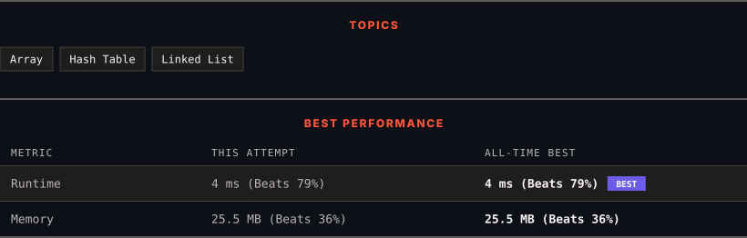

<div align="center">

# 817. Linked List Components

      

[](https://leetcode.com/problems/linked-list-components/)

</div>

---

<div align="center">

<picture>
  <source media="(prefers-color-scheme: dark)" srcset="panel-dark.svg">
  <source media="(prefers-color-scheme: light)" srcset="panel-light.svg">
  
</picture>

</div>

> **New personal best** — Runtime improved on this submission.

### HOW IT WENT

| | |
|:--|:--|
| **Attempts** | first try |
| **Time to solve** | under a minute |
| **Verdicts** | ✅ Accepted |

---

### NOTES

_No notes yet._

---

### SOLUTIONS (1)

| # | File | Language | Date |
|:-:|------|:--------:|:----:|
| 1 | [sol1.cpp](./sol1.cpp) | `C++` | 2026-10-03 ← **latest** |

---

### PROBLEM DESCRIPTION

You are given the `head` of a linked list containing unique integer values and an integer array `nums` that is a subset of the linked list values.

Return the number of **connected** **components** in `nums`. A connected component is a non-empty, maximal sequence of **consecutive** nodes in the linked list such that every node's value belongs to nums.

 

**Example 1:**


```

**Input:** head = [0,1,2,3], nums = [0,1,3]
**Output:** 2
**Explanation:** 0 and 1 are connected, so [0, 1] and [3] are the two connected components.

```

**Example 2:**


```

**Input:** head = [0,1,2,3,4], nums = [0,3,1,4]
**Output:** 2
**Explanation:** 0 and 1 are connected, 3 and 4 are connected, so [0, 1] and [3, 4] are the two connected components.

```

 

**Constraints:**

	- The number of nodes in the linked list is `n`.

	- `1 <= n <= 10^4`

	- `0 <= Node.val < n`

	- All the values `Node.val` are **unique**.

	- `1 <= nums.length <= n`

	- `0 <= nums[i] < n`

	- All the values of `nums` are **unique**.

---

<div align="center">

<sub>Auto-synced by <strong>LeetSync</strong> · Built by <a href="https://deveshsamant.in/">Devesh Samant</a></sub>

</div>
