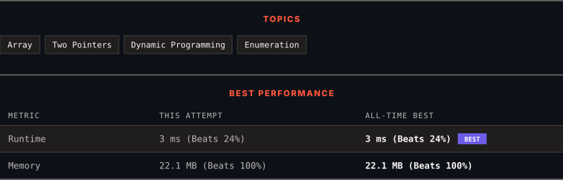

<div align="center">

# 845. Longest Mountain in Array

      

[](https://leetcode.com/problems/longest-mountain-in-array/)

</div>

---

<div align="center">

<picture>
  <source media="(prefers-color-scheme: dark)" srcset="panel-dark.svg">
  <source media="(prefers-color-scheme: light)" srcset="panel-light.svg">
  
</picture>

</div>

> **New personal best** — Runtime improved on this submission.

### HOW IT WENT

| | |
|:--|:--|
| **Attempts** | first try |
| **Time to solve** | under a minute |
| **Verdicts** | ✅ Accepted |

---

### NOTES

_No notes yet._

---

### SOLUTIONS (1)

| # | File | Language | Date |
|:-:|------|:--------:|:----:|
| 1 | [sol1.cpp](./sol1.cpp) | `C++` | 2026-10-04 ← **latest** |

---

### PROBLEM DESCRIPTION

You may recall that an array `arr` is a **mountain array** if and only if:

	- `arr.length >= 3`

	- There exists some index `i` (**0-indexed**) with `0 < i < arr.length - 1` such that:
	

		`arr[0] < arr[1] < ... < arr[i - 1] < arr[i]`

		- `arr[i] > arr[i + 1] > ... > arr[arr.length - 1]`

	

	

Given an integer array `arr`, return *the length of the longest subarray, which is a mountain*. Return `0` if there is no mountain subarray.

 

**Example 1:**

```

**Input:** arr = [2,1,4,7,3,2,5]
**Output:** 5
**Explanation:** The largest mountain is [1,4,7,3,2] which has length 5.

```

**Example 2:**

```

**Input:** arr = [2,2,2]
**Output:** 0
**Explanation:** There is no mountain.

```

 

**Constraints:**

	- `1 <= arr.length <= 10^4`

	- `0 <= arr[i] <= 10^4`

 

**Follow up:**

	- Can you solve it using only one pass?

	- Can you solve it in `O(1)` space?

---

<div align="center">

<sub>Auto-synced by <strong>LeetSync</strong> · Built by <a href="https://deveshsamant.in/">Devesh Samant</a></sub>

</div>
