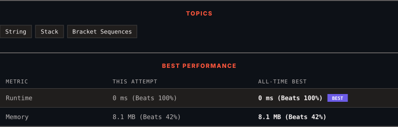

<div align="center">

# 856. Score of Parentheses

      

[](https://leetcode.com/problems/score-of-parentheses/)

</div>

---

<div align="center">

<picture>
  <source media="(prefers-color-scheme: dark)" srcset="panel-dark.svg">
  <source media="(prefers-color-scheme: light)" srcset="panel-light.svg">
  
</picture>

</div>

> **New personal best** — Runtime improved on this submission.

### HOW IT WENT

| | |
|:--|:--|
| **Attempts** | 3 before accepted |
| **Time to solve** | 31 min |
| **Verdicts** | 🔧 Compile Error → ❌ Wrong Answer → ✅ Accepted |

---

### NOTES

_No notes yet._

---

### SOLUTIONS (1)

| # | File | Language | Date |
|:-:|------|:--------:|:----:|
| 1 | [sol1.cpp](./sol1.cpp) | `C++` | 2026-10-06 ← **latest** |

---

### PROBLEM DESCRIPTION

Given a balanced parentheses string `s`, return *the **score** of the string*.

The **score** of a balanced parentheses string is based on the following rule:

	- `"()"` has score `1`.

	- `AB` has score `A + B`, where `A` and `B` are balanced parentheses strings.

	- `(A)` has score `2 * A`, where `A` is a balanced parentheses string.

 

**Example 1:**

```

**Input:** s = "()"
**Output:** 1

```

**Example 2:**

```

**Input:** s = "(())"
**Output:** 2

```

**Example 3:**

```

**Input:** s = "()()"
**Output:** 2

```

 

**Constraints:**

	- `2 <= s.length <= 50`

	- `s` consists of only `'('` and `')'`.

	- `s` is a balanced parentheses string.

---

<div align="center">

<sub>Auto-synced by <strong>LeetSync</strong> · Built by <a href="https://deveshsamant.in/">Devesh Samant</a></sub>

</div>
