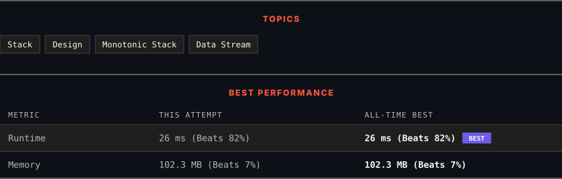

<div align="center">

# 901. Online Stock Span

      

[](https://leetcode.com/problems/online-stock-span/)

</div>

---

<div align="center">

<picture>
  <source media="(prefers-color-scheme: dark)" srcset="panel-dark.svg">
  <source media="(prefers-color-scheme: light)" srcset="panel-light.svg">
  
</picture>

</div>

> **New personal best** — Runtime improved on this submission.

### HOW IT WENT

| | |
|:--|:--|
| **Attempts** | 4 before accepted |
| **Time to solve** | 4 min |
| **Verdicts** | 🔧 Compile Error → ✅ Accepted → ✅ Accepted → ✅ Accepted |

---

### NOTES

_No notes yet._

---

### SOLUTIONS (1)

| # | File | Language | Date |
|:-:|------|:--------:|:----:|
| 1 | [sol1.cpp](./sol1.cpp) | `C++` | 2026-10-07 ← **latest** |

---

### PROBLEM DESCRIPTION

Design an algorithm that collects daily price quotes for some stock and returns **the span** of that stock's price for the current day.

The **span** of the stock's price in one day is the maximum number of consecutive days (starting from that day and going backward) for which the stock price was less than or equal to the price of that day.

	- For example, if the prices of the stock in the last four days are `[7,2,1,2]` and the price of the stock today is 2, then the span of today is 4 because starting from today, the price of the stock was less than or equal to 2 for 4 consecutive days.

	- Also, if the prices of the stock in the last four days is `[7,34,1,2]` and the price of the stock today is `8`, then the span of today is `3` because starting from today, the price of the stock was less than or equal `8` for `3` consecutive days.

Implement the `StockSpanner` class:

	- `StockSpanner()` Initializes the object of the class.

	- `int next(int price)` Returns the **span** of the stock's price given that today's price is `price`.

 

**Example 1:**

```

**Input**
["StockSpanner", "next", "next", "next", "next", "next", "next", "next"]
[[], [100], [80], [60], [70], [60], [75], [85]]
**Output**
[null, 1, 1, 1, 2, 1, 4, 6]

**Explanation**
StockSpanner stockSpanner = new StockSpanner();
stockSpanner.next(100); // return 1
stockSpanner.next(80);  // return 1
stockSpanner.next(60);  // return 1
stockSpanner.next(70);  // return 2
stockSpanner.next(60);  // return 1
stockSpanner.next(75);  // return 4, because the last 4 prices (including today's price of 75) were less than or equal to today's price.
stockSpanner.next(85);  // return 6

```

 

**Constraints:**

	- `1 <= price <= 10^5`

	- At most `10^4` calls will be made to `next`.

---

<div align="center">

<sub>Auto-synced by <strong>LeetSync</strong> · Built by <a href="https://deveshsamant.in/">Devesh Samant</a></sub>

</div>
