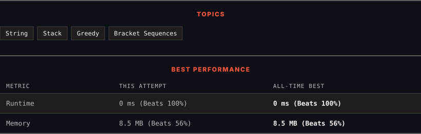

<div align="center">

# 921. Minimum Add to Make Parentheses Valid

      

[](https://leetcode.com/problems/minimum-add-to-make-parentheses-valid/)

</div>

---

<div align="center">

<picture>
  <source media="(prefers-color-scheme: dark)" srcset="panel-dark.svg">
  <source media="(prefers-color-scheme: light)" srcset="panel-light.svg">
  
</picture>

</div>

> **New personal best** — Runtime improved on this submission.

### HOW IT WENT

| | |
|:--|:--|
| **Attempts** | 2 before accepted |
| **Time to solve** | 22 min |
| **Verdicts** | 💥 Runtime Error → ✅ Accepted |

---

### NOTES

_No notes yet._

---

### SOLUTIONS (1)

| # | File | Language | Date |
|:-:|------|:--------:|:----:|
| 1 | [sol1.cpp](./sol1.cpp) | `C++` | 2026-10-06 ← **latest** |

---

### PROBLEM DESCRIPTION

A parentheses string is valid if and only if:

	- It is the empty string,

	- It can be written as `AB` (`A` concatenated with `B`), where `A` and `B` are valid strings, or

	- It can be written as `(A)`, where `A` is a valid string.

You are given a parentheses string `s`. In one move, you can insert a parenthesis at any position of the string.

	- For example, if `s = "()))"`, you can insert an opening parenthesis to be `"(**(**)))"` or a closing parenthesis to be `"())**)**)"`.

Return *the minimum number of moves required to make *`s`* valid*.

 

**Example 1:**

```

**Input:** s = "())"
**Output:** 1

```

**Example 2:**

```

**Input:** s = "((("
**Output:** 3

```

 

**Constraints:**

	- `1 <= s.length <= 1000`

	- `s[i]` is either `'('` or `')'`.

---

<div align="center">

<sub>Auto-synced by <strong>LeetSync</strong> · Built by <a href="https://deveshsamant.in/">Devesh Samant</a></sub>

</div>
