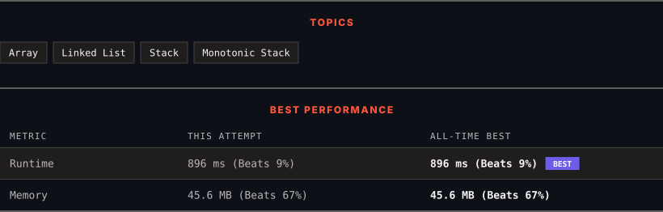

<div align="center">

# 1019. Next Greater Node In Linked List

      

[](https://leetcode.com/problems/next-greater-node-in-linked-list/)

</div>

---

<div align="center">

<picture>
  <source media="(prefers-color-scheme: dark)" srcset="panel-dark.svg">
  <source media="(prefers-color-scheme: light)" srcset="panel-light.svg">
  
</picture>

</div>

> **New personal best** — Runtime improved on this submission.

### HOW IT WENT

| | |
|:--|:--|
| **Attempts** | first try |
| **Time to solve** | under a minute |
| **Verdicts** | ✅ Accepted |

---

### NOTES

_No notes yet._

---

### SOLUTIONS (1)

| # | File | Language | Date |
|:-:|------|:--------:|:----:|
| 1 | [sol1.cpp](./sol1.cpp) | `C++` | 2026-10-03 ← **latest** |

---

### PROBLEM DESCRIPTION

You are given the `head` of a linked list with `n` nodes.

For each node in the list, find the value of the **next greater node**. That is, for each node, find the value of the first node that is next to it and has a **strictly larger** value than it.

Return an integer array `answer` where `answer[i]` is the value of the next greater node of the `i^th` node (**1-indexed**). If the `i^th` node does not have a next greater node, set `answer[i] = 0`.

 

**Example 1:**


```

**Input:** head = [2,1,5]
**Output:** [5,5,0]

```

**Example 2:**


```

**Input:** head = [2,7,4,3,5]
**Output:** [7,0,5,5,0]

```

 

**Constraints:**

	- The number of nodes in the list is `n`.

	- `1 <= n <= 10^4`

	- `1 <= Node.val <= 10^9`

---

<div align="center">

<sub>Auto-synced by <strong>LeetSync</strong> · Built by <a href="https://deveshsamant.in/">Devesh Samant</a></sub>

</div>
