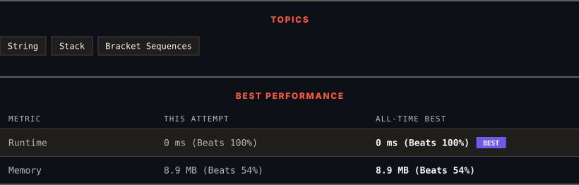

<div align="center">

# 1021. Remove Outermost Parentheses

      

[](https://leetcode.com/problems/remove-outermost-parentheses/)

</div>

---

<div align="center">

<picture>
  <source media="(prefers-color-scheme: dark)" srcset="panel-dark.svg">
  <source media="(prefers-color-scheme: light)" srcset="panel-light.svg">
  
</picture>

</div>

> **New personal best** — Runtime improved on this submission.

### HOW IT WENT

| | |
|:--|:--|
| **Attempts** | first try |
| **Time to solve** | 1 min |
| **Verdicts** | ✅ Accepted |

---

### NOTES

_No notes yet._

---

### SOLUTIONS (1)

| # | File | Language | Date |
|:-:|------|:--------:|:----:|
| 1 | [sol1.cpp](./sol1.cpp) | `C++` | 2026-10-08 ← **latest** |

---

### PROBLEM DESCRIPTION

A valid parentheses string is either empty `""`, `"(" + A + ")"`, or `A + B`, where `A` and `B` are valid parentheses strings, and `+` represents string concatenation.

	- For example, `""`, `"()"`, `"(())()"`, and `"(()(()))"` are all valid parentheses strings.

A valid parentheses string `s` is primitive if it is nonempty, and there does not exist a way to split it into `s = A + B`, with `A` and `B` nonempty valid parentheses strings.

Given a valid parentheses string `s`, consider its primitive decomposition: `s = P_1 + P_2 + ... + P_k`, where `P_i` are primitive valid parentheses strings.

Return `s` *after removing the outermost parentheses of every primitive string in the primitive decomposition of *`s`.

 

**Example 1:**

```

**Input:** s = "(()())(())"
**Output:** "()()()"
**Explanation:** 
The input string is "(()())(())", with primitive decomposition "(()())" + "(())".
After removing outer parentheses of each part, this is "()()" + "()" = "()()()".

```

**Example 2:**

```

**Input:** s = "(()())(())(()(()))"
**Output:** "()()()()(())"
**Explanation:** 
The input string is "(()())(())(()(()))", with primitive decomposition "(()())" + "(())" + "(()(()))".
After removing outer parentheses of each part, this is "()()" + "()" + "()(())" = "()()()()(())".

```

**Example 3:**

```

**Input:** s = "()()"
**Output:** ""
**Explanation:** 
The input string is "()()", with primitive decomposition "()" + "()".
After removing outer parentheses of each part, this is "" + "" = "".

```

 

**Constraints:**

	- `1 <= s.length <= 10^5`

	- `s[i]` is either `'('` or `')'`.

	- `s` is a valid parentheses string.

---

<div align="center">

<sub>Auto-synced by <strong>LeetSync</strong> · Built by <a href="https://deveshsamant.in/">Devesh Samant</a></sub>

</div>
