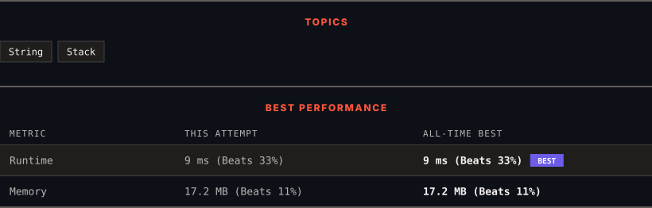

<div align="center">

# 1047. Remove All Adjacent Duplicates In String

      

[](https://leetcode.com/problems/remove-all-adjacent-duplicates-in-string/)

</div>

---

<div align="center">

<picture>
  <source media="(prefers-color-scheme: dark)" srcset="panel-dark.svg">
  <source media="(prefers-color-scheme: light)" srcset="panel-light.svg">
  
</picture>

</div>

> **New personal best** — Runtime improved on this submission.

### HOW IT WENT

| | |
|:--|:--|
| **Attempts** | 2 before accepted |
| **Time to solve** | 17 min |
| **Verdicts** | ✅ Accepted → ✅ Accepted |

---

### NOTES

_No notes yet._

---

### SOLUTIONS (2)

| # | File | Language | Date |
|:-:|------|:--------:|:----:|
| 1 | [sol1.cpp](./sol1.cpp) | `C++` | 2026-10-08 |
| 2 | [sol2.cpp](./sol2.cpp) | `C++` | 2026-10-08 ← **latest** |

---

### PROBLEM DESCRIPTION

You are given a string `s` consisting of lowercase English letters. A **duplicate removal** consists of choosing two **adjacent** and **equal** letters and removing them.

We repeatedly make **duplicate removals** on `s` until we no longer can.

Return *the final string after all such duplicate removals have been made*. It can be proven that the answer is **unique**.

 

**Example 1:**

```

**Input:** s = "abbaca"
**Output:** "ca"
**Explanation:** 
For example, in "abbaca" we could remove "bb" since the letters are adjacent and equal, and this is the only possible move.  The result of this move is that the string is "aaca", of which only "aa" is possible, so the final string is "ca".

```

**Example 2:**

```

**Input:** s = "azxxzy"
**Output:** "ay"

```

 

**Constraints:**

	- `1 <= s.length <= 10^5`

	- `s` consists of lowercase English letters.

---

<div align="center">

<sub>Auto-synced by <strong>LeetSync</strong> · Built by <a href="https://deveshsamant.in/">Devesh Samant</a></sub>

</div>
