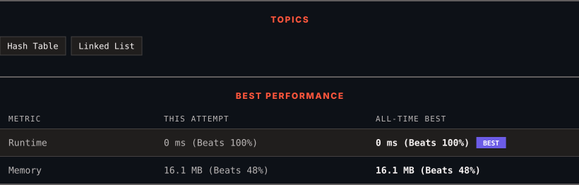

<div align="center">

# 1171. Remove Zero Sum Consecutive Nodes from Linked List

      

[](https://leetcode.com/problems/remove-zero-sum-consecutive-nodes-from-linked-list/)

</div>

---

<div align="center">

<picture>
  <source media="(prefers-color-scheme: dark)" srcset="panel-dark.svg">
  <source media="(prefers-color-scheme: light)" srcset="panel-light.svg">
  
</picture>

</div>

> **New personal best** — Runtime improved on this submission.

### HOW IT WENT

| | |
|:--|:--|
| **Attempts** | 2 before accepted |
| **Time to solve** | 15 min |
| **Verdicts** | ❌ Wrong Answer → ✅ Accepted |

---

### NOTES

_No notes yet._

---

### SOLUTIONS (1)

| # | File | Language | Date |
|:-:|------|:--------:|:----:|
| 1 | [sol1.cpp](./sol1.cpp) | `C++` | 2026-10-03 ← **latest** |

---

### PROBLEM DESCRIPTION

Given the `head` of a linked list, we repeatedly delete consecutive sequences of nodes that sum to `0` until there are no such sequences.


After doing so, return the head of the final linked list.  You may return any such answer.


 

(Note that in the examples below, all sequences are serializations of `ListNode` objects.)

**Example 1:**

```

**Input:** head = [1,2,-3,3,1]
**Output:** [3,1]
**Note:** The answer [1,2,1] would also be accepted.

```

**Example 2:**

```

**Input:** head = [1,2,3,-3,4]
**Output:** [1,2,4]

```

**Example 3:**

```

**Input:** head = [1,2,3,-3,-2]
**Output:** [1]

```

 

**Constraints:**

	- The given linked list will contain between `1` and `1000` nodes.

	- Each node in the linked list has `-1000 <= node.val <= 1000`.

---

<div align="center">

<sub>Auto-synced by <strong>LeetSync</strong> · Built by <a href="https://deveshsamant.in/">Devesh Samant</a></sub>

</div>
