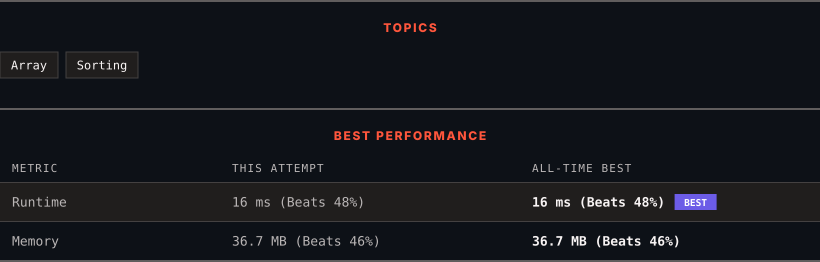

<div align="center">

# 1200. Minimum Absolute Difference

      

[](https://leetcode.com/problems/minimum-absolute-difference/)

</div>

---

<div align="center">

<picture>
  <source media="(prefers-color-scheme: dark)" srcset="panel-dark.svg">
  <source media="(prefers-color-scheme: light)" srcset="panel-light.svg">
  
</picture>

</div>

> **New personal best** — Runtime improved on this submission.

### HOW IT WENT

| | |
|:--|:--|
| **Attempts** | first try |
| **Time to solve** | under a minute |
| **Verdicts** | ✅ Accepted |

---

### NOTES

_No notes yet._

---

### SOLUTIONS (1)

| # | File | Language | Date |
|:-:|------|:--------:|:----:|
| 1 | [sol1.cpp](./sol1.cpp) | `C++` | 2026-10-04 ← **latest** |

---

### PROBLEM DESCRIPTION

Given an array of **distinct** integers `arr`, find all pairs of elements with the minimum absolute difference of any two elements.

Return a list of pairs in ascending order(with respect to pairs), each pair `[a, b]` follows

	- `a, b` are from `arr`

	- `a < b`

	- `b - a` equals to the minimum absolute difference of any two elements in `arr`

 

**Example 1:**

```

**Input:** arr = [4,2,1,3]
**Output:** [[1,2],[2,3],[3,4]]
**Explanation: **The minimum absolute difference is 1. List all pairs with difference equal to 1 in ascending order.
```

**Example 2:**

```

**Input:** arr = [1,3,6,10,15]
**Output:** [[1,3]]

```

**Example 3:**

```

**Input:** arr = [3,8,-10,23,19,-4,-14,27]
**Output:** [[-14,-10],[19,23],[23,27]]

```

 

**Constraints:**

	- `2 <= arr.length <= 10^5`

	- `-10^6 <= arr[i] <= 10^6`

---

<div align="center">

<sub>Auto-synced by <strong>LeetSync</strong> · Built by <a href="https://deveshsamant.in/">Devesh Samant</a></sub>

</div>
