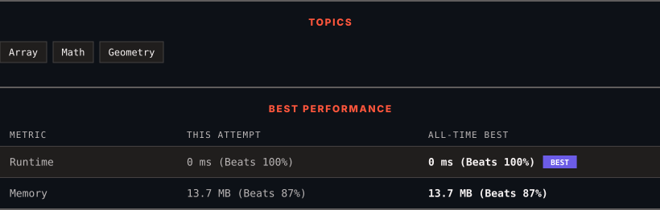

<div align="center">

# 1266. Minimum Time Visiting All Points

      

[](https://leetcode.com/problems/minimum-time-visiting-all-points/)

</div>

---

<div align="center">

<picture>
  <source media="(prefers-color-scheme: dark)" srcset="panel-dark.svg">
  <source media="(prefers-color-scheme: light)" srcset="panel-light.svg">
  
</picture>

</div>

> **New personal best** — Runtime improved on this submission.

### HOW IT WENT

| | |
|:--|:--|
| **Attempts** | first try |
| **Time to solve** | under a minute |
| **Verdicts** | ✅ Accepted |

---

### NOTES

_No notes yet._

---

### SOLUTIONS (1)

| # | File | Language | Date |
|:-:|------|:--------:|:----:|
| 1 | [sol1.cpp](./sol1.cpp) | `C++` | 2026-10-04 ← **latest** |

---

### PROBLEM DESCRIPTION

On a 2D plane, there are `n` points with integer coordinates `points[i] = [x_i, y_i]`. Return *the **minimum time** in seconds to visit all the points in the order given by *`points`.

You can move according to these rules:

	- In `1` second, you can either:

	

		move vertically by one unit,

		- move horizontally by one unit, or

		- move diagonally `sqrt(2)` units (in other words, move one unit vertically then one unit horizontally in `1` second).

	

	
	- You have to visit the points in the same order as they appear in the array.

	- You are allowed to pass through points that appear later in the order, but these do not count as visits.

 

**Example 1:**


```

**Input:** points = [[1,1],[3,4],[-1,0]]
**Output:** 7
**Explanation: **One optimal path is **[1,1]** -> [2,2] -> [3,3] -> **[3,4] **-> [2,3] -> [1,2] -> [0,1] -> **[-1,0]**   
Time from [1,1] to [3,4] = 3 seconds 
Time from [3,4] to [-1,0] = 4 seconds
Total time = 7 seconds
```

**Example 2:**

```

**Input:** points = [[3,2],[-2,2]]
**Output:** 5

```

 

**Constraints:**

	- `points.length == n`

	- `1 <= n <= 100`

	- `points[i].length == 2`

	- `-1000 <= points[i][0], points[i][1] <= 1000`

---

<div align="center">

<sub>Auto-synced by <strong>LeetSync</strong> · Built by <a href="https://deveshsamant.in/">Devesh Samant</a></sub>

</div>
