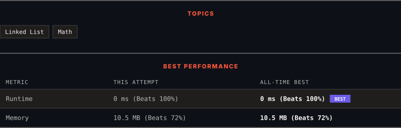

<div align="center">

# 1290. Convert Binary Number in a Linked List to Integer

      

[](https://leetcode.com/problems/convert-binary-number-in-a-linked-list-to-integer/)

</div>

---

<div align="center">

<picture>
  <source media="(prefers-color-scheme: dark)" srcset="panel-dark.svg">
  <source media="(prefers-color-scheme: light)" srcset="panel-light.svg">
  
</picture>

</div>

> **New personal best** — Runtime improved on this submission.

### HOW IT WENT

| | |
|:--|:--|
| **Attempts** | 2 before accepted |
| **Time to solve** | 1 min |
| **Verdicts** | 🔧 Compile Error → ✅ Accepted |

---

### NOTES

_No notes yet._

---

### SOLUTIONS (1)

| # | File | Language | Date |
|:-:|------|:--------:|:----:|
| 1 | [sol1.cpp](./sol1.cpp) | `C++` | 2026-10-02 ← **latest** |

---

### PROBLEM DESCRIPTION

Given `head` which is a reference node to a singly-linked list. The value of each node in the linked list is either `0` or `1`. The linked list holds the binary representation of a number.

Return the *decimal value* of the number in the linked list.

The **most significant bit** is at the head of the linked list.

 

**Example 1:**


```

**Input:** head = [1,0,1]
**Output:** 5
**Explanation:** (101) in base 2 = (5) in base 10

```

**Example 2:**

```

**Input:** head = [0]
**Output:** 0

```

 

**Constraints:**

	- The Linked List is not empty.

	- Number of nodes will not exceed `30`.

	- Each node's value is either `0` or `1`.

---

<div align="center">

<sub>Auto-synced by <strong>LeetSync</strong> · Built by <a href="https://deveshsamant.in/">Devesh Samant</a></sub>

</div>
