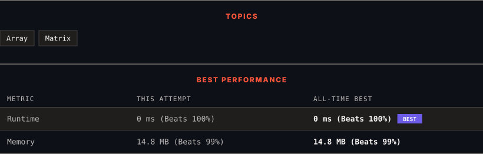

<div align="center">

# 1572. Matrix Diagonal Sum

      

[](https://leetcode.com/problems/matrix-diagonal-sum/)

</div>

---

<div align="center">

<picture>
  <source media="(prefers-color-scheme: dark)" srcset="panel-dark.svg">
  <source media="(prefers-color-scheme: light)" srcset="panel-light.svg">
  
</picture>

</div>

> **New personal best** — Runtime improved on this submission.

### HOW IT WENT

| | |
|:--|:--|
| **Attempts** | 3 before accepted |
| **Time to solve** | under a minute |
| **Verdicts** | 🔧 Compile Error → 🔧 Compile Error → ✅ Accepted |

---

### NOTES

_No notes yet._

---

### SOLUTIONS (1)

| # | File | Language | Date |
|:-:|------|:--------:|:----:|
| 1 | [sol1.cpp](./sol1.cpp) | `C++` | 2026-10-03 ← **latest** |

---

### PROBLEM DESCRIPTION

Given a square matrix `mat`, return the sum of the matrix diagonals.

Only include the sum of all the elements on the primary diagonal and all the elements on the secondary diagonal that are not part of the primary diagonal.

 

**Example 1:**


```

**Input:** mat = [[**1**,2,**3**],
              [4,**5**,6],
              [**7**,8,**9**]]
**Output:** 25
**Explanation: **Diagonals sum: 1 + 5 + 9 + 3 + 7 = 25
Notice that element mat[1][1] = 5 is counted only once.

```

**Example 2:**

```

**Input:** mat = [[**1**,1,1,**1**],
              [1,**1**,**1**,1],
              [1,**1**,**1**,1],
              [**1**,1,1,**1**]]
**Output:** 8

```

**Example 3:**

```

**Input:** mat = [[**5**]]
**Output:** 5

```

 

**Constraints:**

	- `n == mat.length == mat[i].length`

	- `1 <= n <= 100`

	- `1 <= mat[i][j] <= 100`

---

<div align="center">

<sub>Auto-synced by <strong>LeetSync</strong> · Built by <a href="https://deveshsamant.in/">Devesh Samant</a></sub>

</div>
