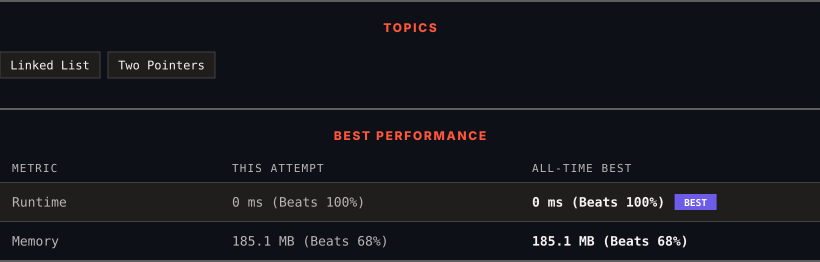

<div align="center">

# 1721. Swapping Nodes in a Linked List

      

[](https://leetcode.com/problems/swapping-nodes-in-a-linked-list/)

</div>

---

<div align="center">

<picture>
  <source media="(prefers-color-scheme: dark)" srcset="panel-dark.svg">
  <source media="(prefers-color-scheme: light)" srcset="panel-light.svg">
  
</picture>

</div>

> **New personal best** — Runtime improved on this submission.

### HOW IT WENT

| | |
|:--|:--|
| **Attempts** | first try |
| **Time to solve** | under a minute |
| **Verdicts** | ✅ Accepted |

---

### NOTES

_No notes yet._

---

### SOLUTIONS (1)

| # | File | Language | Date |
|:-:|------|:--------:|:----:|
| 1 | [sol1.cpp](./sol1.cpp) | `C++` | 2026-10-02 ← **latest** |

---

### PROBLEM DESCRIPTION

You are given the `head` of a linked list, and an integer `k`.

Return *the head of the linked list after **swapping** the values of the *`k^th` *node from the beginning and the *`k^th` *node from the end (the list is **1-indexed**).*

 

**Example 1:**


```

**Input:** head = [1,2,3,4,5], k = 2
**Output:** [1,4,3,2,5]

```

**Example 2:**

```

**Input:** head = [7,9,6,6,7,8,3,0,9,5], k = 5
**Output:** [7,9,6,6,8,7,3,0,9,5]

```

 

**Constraints:**

	- The number of nodes in the list is `n`.

	- `1 <= k <= n <= 10^5`

	- `0 <= Node.val <= 100`

---

<div align="center">

<sub>Auto-synced by <strong>LeetSync</strong> · Built by <a href="https://deveshsamant.in/">Devesh Samant</a></sub>

</div>
