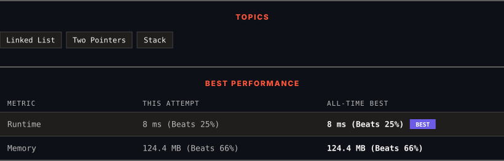

<div align="center">

# 2130. Maximum Twin Sum of a Linked List

      

[](https://leetcode.com/problems/maximum-twin-sum-of-a-linked-list/)

</div>

---

<div align="center">

<picture>
  <source media="(prefers-color-scheme: dark)" srcset="panel-dark.svg">
  <source media="(prefers-color-scheme: light)" srcset="panel-light.svg">
  
</picture>

</div>

> **New personal best** — Runtime improved on this submission.

### HOW IT WENT

| | |
|:--|:--|
| **Attempts** | 3 before accepted |
| **Time to solve** | 4 min |
| **Verdicts** | ⏱ Time Limit Exceeded → ⏱ Time Limit Exceeded → ✅ Accepted |

---

### NOTES

_No notes yet._

---

### SOLUTIONS (1)

| # | File | Language | Date |
|:-:|------|:--------:|:----:|
| 1 | [sol1.cpp](./sol1.cpp) | `C++` | 2026-10-03 ← **latest** |

---

### PROBLEM DESCRIPTION

In a linked list of size `n`, where `n` is **even**, the `i^th` node (**0-indexed**) of the linked list is known as the **twin** of the `(n-1-i)^th` node, if `0 <= i <= (n / 2) - 1`.

	- For example, if `n = 4`, then node `0` is the twin of node `3`, and node `1` is the twin of node `2`. These are the only nodes with twins for `n = 4`.

The **twin sum **is defined as the sum of a node and its twin.

Given the `head` of a linked list with even length, return *the **maximum twin sum** of the linked list*.

 

**Example 1:**


```

**Input:** head = [5,4,2,1]
**Output:** 6
**Explanation:**
Nodes 0 and 1 are the twins of nodes 3 and 2, respectively. All have twin sum = 6.
There are no other nodes with twins in the linked list.
Thus, the maximum twin sum of the linked list is 6. 

```

**Example 2:**


```

**Input:** head = [4,2,2,3]
**Output:** 7
**Explanation:**
The nodes with twins present in this linked list are:
- Node 0 is the twin of node 3 having a twin sum of 4 + 3 = 7.
- Node 1 is the twin of node 2 having a twin sum of 2 + 2 = 4.
Thus, the maximum twin sum of the linked list is max(7, 4) = 7. 

```

**Example 3:**


```

**Input:** head = [1,100000]
**Output:** 100001
**Explanation:**
There is only one node with a twin in the linked list having twin sum of 1 + 100000 = 100001.

```

 

**Constraints:**

	- The number of nodes in the list is an **even** integer in the range `[2, 10^5]`.

	- `1 <= Node.val <= 10^5`

---

<div align="center">

<sub>Auto-synced by <strong>LeetSync</strong> · Built by <a href="https://deveshsamant.in/">Devesh Samant</a></sub>

</div>
