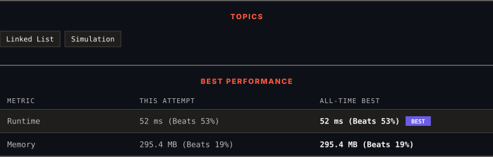

<div align="center">

# 2181. Merge Nodes in Between Zeros

      

[](https://leetcode.com/problems/merge-nodes-in-between-zeros/)

</div>

---

<div align="center">

<picture>
  <source media="(prefers-color-scheme: dark)" srcset="panel-dark.svg">
  <source media="(prefers-color-scheme: light)" srcset="panel-light.svg">
  
</picture>

</div>

> **New personal best** — Runtime improved on this submission.

### HOW IT WENT

| | |
|:--|:--|
| **Attempts** | first try |
| **Time to solve** | under a minute |
| **Verdicts** | ✅ Accepted |

---

### NOTES

_No notes yet._

---

### SOLUTIONS (1)

| # | File | Language | Date |
|:-:|------|:--------:|:----:|
| 1 | [sol1.cpp](./sol1.cpp) | `C++` | 2026-10-03 ← **latest** |

---

### PROBLEM DESCRIPTION

You are given the `head` of a linked list, which contains a series of integers **separated** by `0`'s. The **beginning** and **end** of the linked list will have `Node.val == 0`.

For **every **two consecutive `0`'s, **merge** all the nodes lying in between them into a single node whose value is the **sum** of all the merged nodes. The modified list should not contain any `0`'s.

Return *the* `head` *of the modified linked list*.

 

**Example 1:**


```

**Input:** head = [0,3,1,0,4,5,2,0]
**Output:** [4,11]
**Explanation:** 
The above figure represents the given linked list. The modified list contains
- The sum of the nodes marked in green: 3 + 1 = 4.
- The sum of the nodes marked in red: 4 + 5 + 2 = 11.

```

**Example 2:**


```

**Input:** head = [0,1,0,3,0,2,2,0]
**Output:** [1,3,4]
**Explanation:** 
The above figure represents the given linked list. The modified list contains
- The sum of the nodes marked in green: 1 = 1.
- The sum of the nodes marked in red: 3 = 3.
- The sum of the nodes marked in yellow: 2 + 2 = 4.

```

 

**Constraints:**

	- The number of nodes in the list is in the range `[3, 2 * 10^5]`.

	- `0 <= Node.val <= 1000`

	- There are **no** two consecutive nodes with `Node.val == 0`.

	- The **beginning** and **end** of the linked list have `Node.val == 0`.

---

<div align="center">

<sub>Auto-synced by <strong>LeetSync</strong> · Built by <a href="https://deveshsamant.in/">Devesh Samant</a></sub>

</div>
