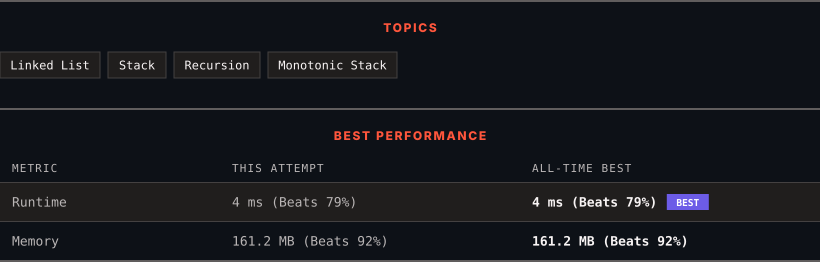

<div align="center">

# 2487. Remove Nodes From Linked List

      

[](https://leetcode.com/problems/remove-nodes-from-linked-list/)

</div>

---

<div align="center">

<picture>
  <source media="(prefers-color-scheme: dark)" srcset="panel-dark.svg">
  <source media="(prefers-color-scheme: light)" srcset="panel-light.svg">
  
</picture>

</div>

> **New personal best** — Runtime improved on this submission.

### HOW IT WENT

| | |
|:--|:--|
| **Attempts** | first try |
| **Time to solve** | 5 min |
| **Verdicts** | ✅ Accepted |

---

### NOTES

_No notes yet._

---

### SOLUTIONS (1)

| # | File | Language | Date |
|:-:|------|:--------:|:----:|
| 1 | [sol1.cpp](./sol1.cpp) | `C++` | 2026-10-02 ← **latest** |

---

### PROBLEM DESCRIPTION

You are given the `head` of a linked list.

Remove every node which has a node with a greater value anywhere to the right side of it.

Return *the *`head`* of the modified linked list.*

 

**Example 1:**


```

**Input:** head = [5,2,13,3,8]
**Output:** [13,8]
**Explanation:** The nodes that should be removed are 5, 2 and 3.
- Node 13 is to the right of node 5.
- Node 13 is to the right of node 2.
- Node 8 is to the right of node 3.

```

**Example 2:**

```

**Input:** head = [1,1,1,1]
**Output:** [1,1,1,1]
**Explanation:** Every node has value 1, so no nodes are removed.

```

 

**Constraints:**

	- The number of the nodes in the given list is in the range `[1, 10^5]`.

	- `1 <= Node.val <= 10^5`

---

<div align="center">

<sub>Auto-synced by <strong>LeetSync</strong> · Built by <a href="https://deveshsamant.in/">Devesh Samant</a></sub>

</div>
