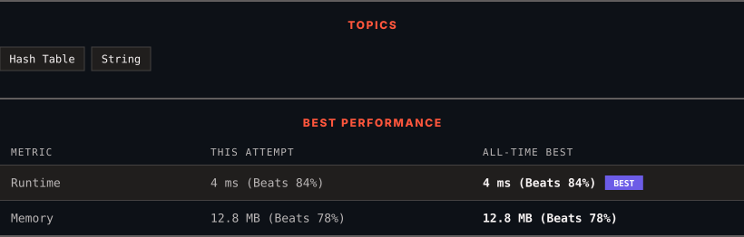

# 2716. Minimize String Length

      

---

<picture>
  <source media="(prefers-color-scheme: dark)" srcset="panel-dark.svg">
  <source media="(prefers-color-scheme: light)" srcset="panel-light.svg">
  
</picture>

> **New personal best** — Runtime improved on this submission.

### HOW IT WENT

| | |
|:--|:--|
| **Attempts** | first try |
| **Time to solve** | 21 min |
| **Verdicts** | ✅ Accepted |

---

### NOTES

_No notes yet._

---

### SOLUTIONS (1)

| # | File | Language | Date |
|:-:|------|:--------:|:----:|
| 1 | [sol1.cpp](./sol1.cpp) | `C++` | 2026-10-08 ← **latest** |

---

### PROBLEM DESCRIPTION

Given a string `s`, you have two types of operation:

	- Choose an index `i` in the string, and let `c` be the character in position `i`. **Delete** the **closest occurrence** of `c` to the **left** of `i` (if exists).

	- Choose an index `i` in the string, and let `c` be the character in position `i`. **Delete** the **closest occurrence** of `c` to the **right** of `i` (if exists).

Your task is to **minimize** the length of `s` by performing the above operations zero or more times.

Return an integer denoting the length of the **minimized** string.

 

**Example 1:**

**Input:** s = "aaabc"

**Output:** 3

**Explanation:**

	- Operation 2: we choose `i = 1` so `c` is 'a', then we remove `s[2]` as it is closest 'a' character to the right of `s[1]`.

	`s` becomes "aabc" after this.

	- Operation 1: we choose `i = 1` so `c` is 'a', then we remove `s[0]` as it is closest 'a' character to the left of `s[1]`.

	`s` becomes "abc" after this.

**Example 2:**

**Input:** s = "cbbd"

**Output:** 3

**Explanation:**

	- Operation 1: we choose `i = 2` so `c` is 'b', then we remove `s[1]` as it is closest 'b' character to the left of `s[1]`.

	`s` becomes "cbd" after this.

**Example 3:**

**Input:** s = "baadccab"

**Output:** 4

**Explanation:**

	- Operation 1: we choose `i = 6` so `c` is 'a', then we remove `s[2]` as it is closest 'a' character to the left of `s[6]`.

	`s` becomes "badccab" after this.

	- Operation 2: we choose `i = 0` so `c` is 'b', then we remove `s[6]` as it is closest 'b' character to the right of `s[0]`.

	`s` becomes "badcca" fter this.

	- Operation 2: we choose `i = 3` so `c` is 'c', then we remove `s[4]` as it is closest 'c' character to the right of `s[3]`.

	`s` becomes "badca" after this.

	- Operation 1: we choose `i = 4` so `c` is 'a', then we remove `s[1]` as it is closest 'a' character to the left of `s[4]`.

	`s` becomes "bdca" after this.

 

**Constraints:**

	- `1 <= s.length <= 100`

	- `s` contains only lowercase English letters

---

Auto-synced by <strong>LeetSync</strong> · Built by <a href="https://deveshsamant.in/">Devesh Samant</a>

